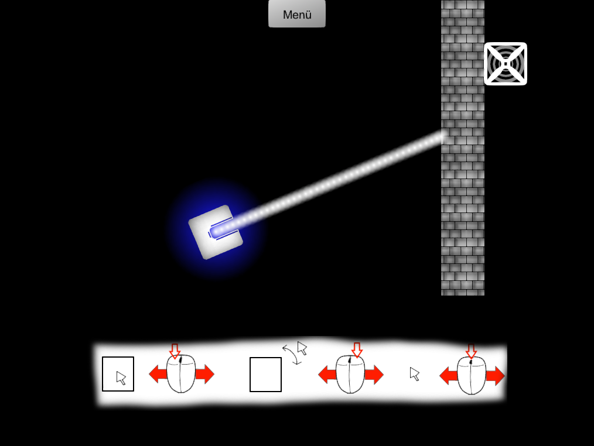
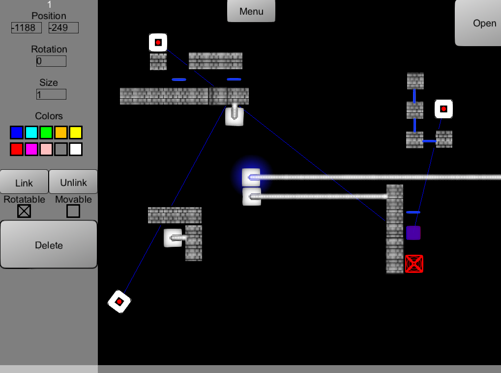

# LiRa
Lira is a 2D Java game using Slick2D in which you try to shoot light rays into the goal.  
## Features 
- 7 campaign levels 
- A level editor 
- Upload and Download user-created levels 
## Game Concept 
- A light emitter shoots a ray
- This ray needs to be guided to a goal
- The goal and the light ray must match in color
- You can alter the color of the light with a colored glass
- You can reflect light with mirrors
- An activator can be linked to an object
- This object will move to a specific location, if the activator is activated
- You can activate an activator with the corresponding color

Download: https://www.dropbox.com/s/e2encctcx6pz2op/LiRa.zip?dl=0  

  
  
  
